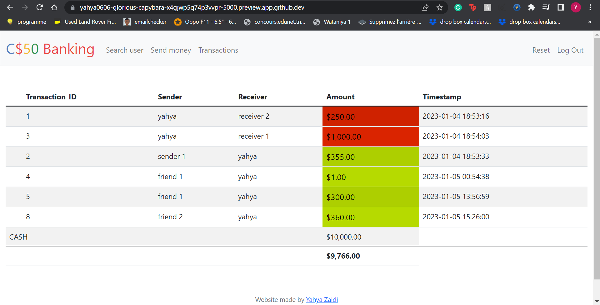

# CS50 Banking
#### Video Demo:  <[Project Demo on Youtube](https://youtu.be/9VwCtq6cuDA)>
#### Description:A simple Online-Banking website
TODO

# C$50 Finance

Implement a website via which users can send money, as shown the below.



## Background

You're about to implement C$50 Banking, a web app via which you can manage portfolios of your bank account. Not only will this tool allow you to check your account and send money to friends.

### Running

Start Flask's built-in web server (within `project/`):

```
$ flask run
```

#### `requirements.txt`

Next take a quick look at `requirements.txt`. That file simply prescribes the packages on which this app will depend.

#### `static/`

Glance too at `static/`, inside of which is `styles.css`. That's where some initial CSS lives. You're welcome to alter it as you see fit.

### `register`

Complete the implementation of `register` in such a way that it allows a user to register for an account via a form.

* Require that a user input a username, implemented as a text field whose `name` is `username`. Render an apology if the user's input is blank or the username already exists.
* Require that a user input a password, implemented as a text field whose `name` is `password`, and then that same password again, implemented as a text field whose `name` is `confirmation`. Render an apology if either input is blank or the passwords do not match.
* Submit the user's input via `POST` to `/register`.
* `INSERT` the new user into `users`, storing a hash of the user's password, not the password itself. Hash the user's password with [`generate_password_hash`](https://werkzeug.palletsprojects.com/en/1.0.x/utils/#werkzeug.security.generate_password_hash) Odds are you'll want to create a new template (e.g., `register.html`) that's quite similar to `login.html`.

Once you've implemented `register` correctly, you should be able to register for an account and log in (since `login` and `logout` already work)! And you should be able to see your rows via phpLiteAdmin or `sqlite3`.

### `send`

Complete the implementation of `search` in such a way that it allows a user to search if user exists so he can send money to.

* Require that a user input a user, implemented as a text field whose `name` is `receiver`.
* Submit the user's input via `POST` to `/search`.
* Odds are you'll want to create two new templates (e.g., `search.html`). When a user visits `/search` via GET, render one of those templates, inside of which should be an HTML form that submits to `/search` via POST. In response to a POST, `search` can render that second template, embedding within it one or more values from
